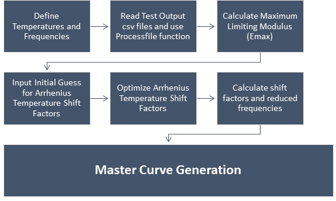

# Dynamic Modulus Master Curve for Hot Mix Asphalt (HMA)
## Name: Armin Motahari (arminm@ksu.edu)
## Semester: Spring 2020
## Project Area: Civil Engineering
***

***
### Background: 

Dynamic Modulus, E is a complex parameter that relates stress to strain of a linear viscoelastic material as a function of loading rate and temperature. It Describes how the stiffness of HMA mixtures varies over a range of service temperatures and loading traffic rates. Recently State Departments of transformations gained more attention to the Dynamic Modulus as a main input for HMA material in the Mechanistic Empirical Pavement Design Guide (MEPDG).

Temperature and loading frequency are two main factors which Captured from Master Curves. Master Curves are being constructed based on the time-temperature superposition concept. Collecting data for various temperatures and loading frequencies, producing a smooth single master curve. This program is used in conjunction with the Simple Performance Test System to develop dynamic modulus master curves.  It has the capability to solve a modified version of the Mechanistic-Empirical Design Guide master curve Equation.

***
### Objectives:
 
The Objective is to solve a "modified version of the Mechanistic-Empirical Design Guide master curve equation". This program reads directly the raw output data related to a series of tests performed for a single Hot Mix Asphalt Material from extracted .csv files, then generates the its related curve at a defined reference temperature, in an easy and fast process. After running the program you will have following outputs: 

1- Table 01: Dynamic modulus values at the temperatures and frequencies required by the Mechanistic Emprical Pavement Desgin Guide (MEPDG)

2- Figure 01: Dynamic modulus Lab values and shifting procedure to draw the Dynamic Modulus Master Curve

3- Table 02: Dynamic modulus values on the Master Curve in reduced frequencies and reference temperature

4- Figure 02: Dynamic modulus Master Curve

***
### Sketch:
Figure 1 shows the workflow and steps in runnig the program. This flowchart presents a big picture of the work. The details can easily be followed up in program file with used equtions and their related parameters.

 

Figure 1: Workflow of the project

***
References: 

(1) Standard Test Method for Dynamic Modulus of Asphalt Concrete Mixtures. National Cooperative Highway Research Program 1-37A Provisional Test Method DM-1, Arizona State University, June 2002. 

(2) Huang, Y. H. (1993). Pavement analysis and design.
